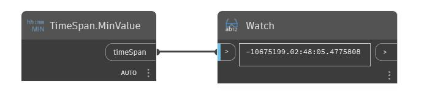

## Im Detail
MinValue gibt den Mindestwert für einen TimeSpan-Wert zurück. Im folgenden Beispiel wird ein TimeSpan-Wert von 10,675,199 Tagen, 2 Stunden, 28 Minuten, 5 Sekunden und 477 Millisekunden zurückgegeben.
___
## Beispieldatei

