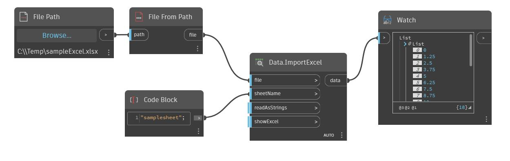

## Im Detail
Liest Daten aus einer Microsoft Excel-Tabelle. Die Daten werden nach Zeilen gelesen und in einer Folge von Listen nach Zeilen zurückgegeben. Zeilen und Spalten sind nullindiziert. Beispiel: Der Wert aus Zelle A1 erscheint in der Datenliste an Position [0,0]. Für diesen Block muss Microsoft Excel installiert sein.
___
## Beispieldatei

