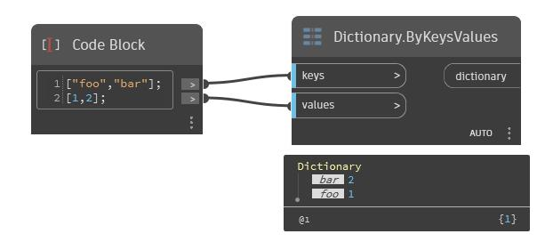

## Im Detail
ByKeysValues gibt ein Wörterbuch anhand der Schlüssel (Zeichenfolgen), nach denen gesucht werden soll, und der Werte zurück, die ausgegeben werden sollen. Die Anzahl der Einträge im Wörterbuch entspricht der jeweils kürzeren Eingabe.
___
## Beispieldatei

