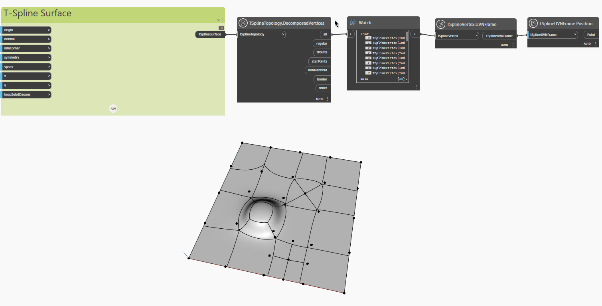

<!--- Autodesk.DesignScript.Geometry.TSpline.TSplineTopology.DecomposedVertices --->
<!--- GNCPW2XCPOITIUUDNZKISNP347TEGTDWVI5SQTBJX3JWFZTVRXGA --->
## Im Detail
Im folgenden Beispiel wird eine planare T-Spline-Oberfläche mit extrudierten, unterteilten und gezogenen Scheitelpunkten und Flächen mit dem Block `TSplineTopology.DecomposedVertices` überprüft, wodurch eine Liste der folgenden Scheitelpunkttypen zurückgegeben wird, die in der T-Spline-Oberfläche enthalten sind:

- `all`: Liste aller Scheitelpunkte
- `regular`: Liste der regulären Scheitelpunkte
- `tPoints`: Liste der T-Punkt-Scheitelpunkte
- `starPoints`: Liste der Sternpunkt-Scheitelpunkte
- `nonManifold`: Liste der nicht mannigfaltigen Scheitelpunkte
- `border`: Liste der Randscheitelpunkte
- `inner`: Liste der inneren Scheitelpunkte

Die Blöcke `TSplineVertex.UVNFrame` und `TSplineUVNFrame.Position` werden verwendet, um die verschiedenen Scheitelpunkttypen der Oberfläche hervorzuheben.

___
## Beispieldatei

