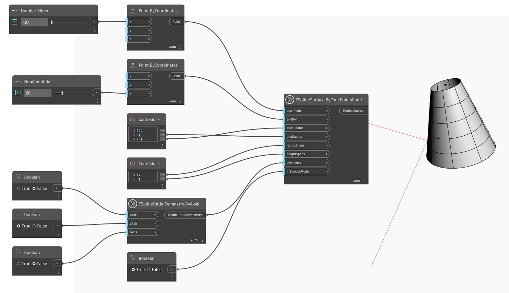

<!--- Autodesk.DesignScript.Geometry.TSpline.TSplineSurface.ByConePointsRadii --->
<!--- H54SEHAY3YGO3MOAVNNGUJ3QI6IP6X6CQRV54A3GDLT46TUD6UHA --->
## In-Depth
Im folgenden Beispiel wird ein T-Spline-Kegelgrundkörper mit dem Block `TSplineSurface.ByConePointsRadii` erstellt. Position und Höhe des Kegels werden durch die beiden Eingaben `startPoint` und `endPoint` gesteuert. Der Basis- und der obere Radius können mit den Eingaben `startRadius` und `topRadius` angepasst werden. `radialSpans` und `heightSpans` bestimmen die radialen und Höhenfelder. Die anfängliche Symmetrie der Form wird durch die Eingabe `symmetry` festgelegt. Wenn die X- oder Y-Symmetrie auf True gesetzt ist, muss der Wert der radialen Felder ein Vielfaches von 4 sein. Schließlich wird die Eingabe `inSmoothMode` verwendet, um zwischen der Vorschau im Modus Glatt und Quader der T-Spline-Fläche zu wechseln.

## Beispieldatei

