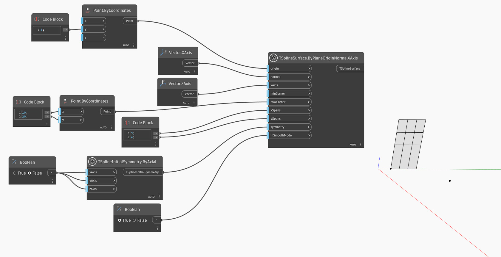

<!--- Autodesk.DesignScript.Geometry.TSpline.TSplineSurface.ByPlaneOriginNormalXAxis --->
<!--- IPJR2I55VFC67ZT5OYCCOOAEDH2AHY3CSCZKVXKIXALKV7IBDERA --->
## In-Depth
`TSplineSurface.ByPlaneOriginNormalXAxis` generiert mithilfe eines Ursprungspunkts, eines Normalenvektors und einer Vektorrichtung der X-Achse der Ebene eine T-Spline-Grundkörper-Ebenenoberfläche. Zum Erstellen der T-Spline-Ebene verwendet der Block die folgenden Eingaben:
- `origin`: a point defining the origin of the plane.
- `normal`: a vector specifying the normal direction of the created plane.
- `xAxis`: Vektor, der die Richtung der X-Achse definiert, was eine bessere Kontrolle über die Ausrichtung der erstellten Ebene ermöglicht.
- `minCorner` and `maxCorner`: the corners of the plane, represented as Points with X and Y values (Z coordinates will be ignored). These corners represent the extents of the output T-Spline surface if it is translated onto the XY plane. The `minCorner` and `maxCorner` points do not have to coincide with the corner vertices in 3D. For example, when a `minCorner` is set to (0,0) and `maxCorner` is (5,10), the plane width and length will be 5 and 10 respectively.
- `xSpans` and `ySpans`: number of width and length spans/divisions of the plane
- `symmetry`: whether the geometry is symmetrical with respect to its X, Y and Z axes
- `inSmoothMode`: whether the resulting geometry will appear with smooth or box mode

Im folgenden Beispiel wird eine planare T-Spline-Oberfläche erstellt, indem der angegebene Ursprungspunkt und die Normale verwendet werden, die ein Vektor der X-Achse ist. Die Eingabe `xAxis` wird auf die Z-Achse festgelegt. Die Größe der Oberfläche wird durch die beiden als `minCorner`- und `maxCorner`-Eingaben verwendeten Punkte gesteuert.

## Beispieldatei

