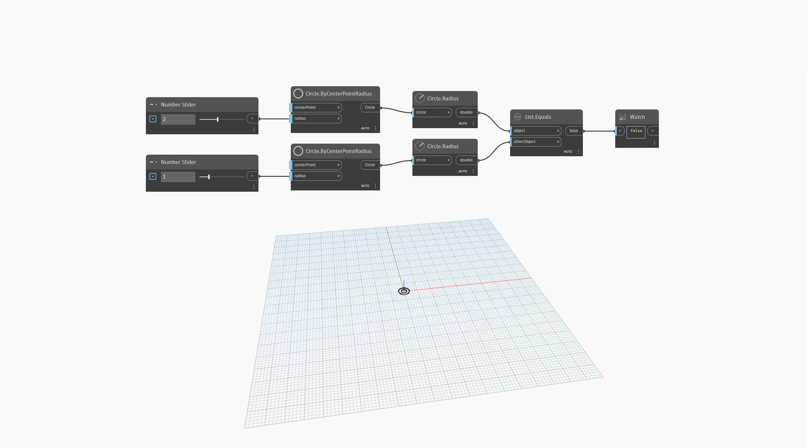

## Im Detail
`List.Equals` gibt einen booleschen True-Wert zurück, wenn beide Eingabeobjekte identisch sind.

Im folgenden Beispiel werden die Radien (double-Werte) von zwei Kreisen verglichen. Wenn die Zahlen-Schieberegler unterschiedliche Werte aufweisen, gibt `List.Equals` den Wert False zurück. Wenn beide Werte gleich sind, gibt `List.Equals` den Wert True zurück.
___
## Beispieldatei

