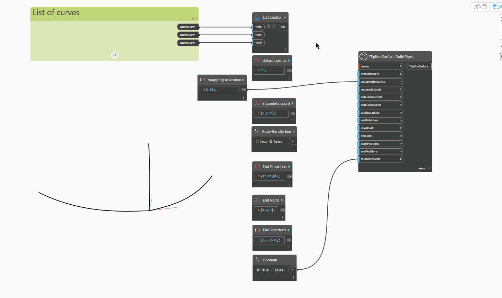

## In-Depth
`TSplineSurface.BuildPipes` generiert eine durch Piping erstellte T-Spline-Oberfläche mithilfe eines Netzes von Kurven. Einzelne Rohre gelten als verbunden, wenn ihre Endpunkte innerhalb der durch die Eingabe `snappingTolerance` festgelegten maximalen Toleranz liegen. Das Ergebnis dieses Blocks kann mit einer Reihe von Eingaben, mit denen Werte für alle Rohre oder einzelne Rohre festgelegt werden können, verfeinert werden, wenn die Eingabe eine Liste ist, die der Anzahl der Rohre entspricht. Die folgenden Eingaben können auf diese Weise verwendet werden: `segmentsCount`, `startRotations`, `endRotations`, `startRadii`, `endRadii`, `startPositions` und `endPositions`.

Im folgenden Beispiel werden drei an Endpunkten verbundene Kurven als Eingabe für den Block `TSplineSurface.BuildPipes` bereitgestellt. Der Block `defaultRadius` ist in diesem Fall ein einzelner Wert für alle drei Rohre, der vorgabemäßig den Radius der Rohre definiert, sofern keine Anfangs- und Endradien angegeben sind.
Als Nächstes legt `segmentsCount` drei verschiedene Werte für jedes einzelne Rohr fest. Die Eingabe ist eine Liste mit drei Werten, die jeweils einem Rohr entsprechen.

Wenn für `autoHandleStart` und `autoHandleEnd` False festgelegt ist, sind weitere Anpassungen verfügbar. Damit können Sie die Start- und Enddrehungen jedes Rohrs (Eingaben `startRotations` und `endRotations`) sowie die Radien am Ende und Anfang jedes Rohrs durch Angabe von `startRadii` und `endRadii` steuern. Schließlich können Sie mit `startPositions` und `endPositions` die Segmente am Anfang bzw. Ende jeder Kurve versetzen. Bei dieser Eingabe wird ein Wert erwartet, der dem Parameter der Kurve entspricht, an der die Segmente beginnen oder enden (Werte zwischen 0 und 1).

## Beispieldatei

