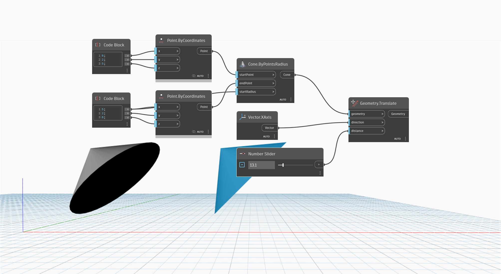

<!--- Autodesk.DesignScript.Geometry.Geometry.Translate(direction, distance) --->
<!--- M4QGSXM2OJC62OCBK7RPJB4QI2KY3B3N3OAB4I4GHJNAOMXLKKRA --->
## Im Detail
`Geometry.Translate (direction, distance)` verschiebt eingegebene Geometrie in eine bestimmte Vektorrichtung. Die `distance`-Eingabe steuert den Verschiebungsabstand.

Im folgenden Beispiel wird ein Kegel entlang der X-Achse verschoben. Sein Abstand vom ursprünglichen Kegel wird mit einem Zahlen-Schieberegler gesteuert.

Im folgenden Beispiel wird ein Quader in eine Volumenkörperdef. konvertiert. Kopieren Sie den Inhalt des Watch-Blocks, um die Volumenkörperdef.-Zeichenfolgendarstellung in einem anderen Diagramm zu verwenden.

___
## Beispieldatei

