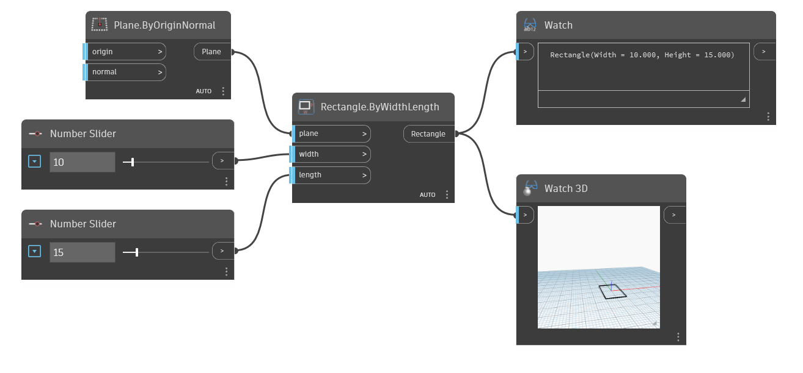

<!--- Autodesk.DesignScript.Geometry.Rectangle.ByWidthLength(plane, width, length) --->
<!--- MNNWHJCYE2KIJHONO2J56LQNPLRQZZARI7KF2BP4OJ6BRWGDXPAQ --->
## Im Detail
Erstellt ein Rechteck zentriert am Ursprung der Eingabeebene mit der angegebenen Breite (X-Achse) und Länge (Y-Achse). In diesem Beispiel wird die Welt-YZ-Ebene als Eingabeebene verwendet. Die Breite gibt die X-Achsenlänge der Ebene an, die in diesem Fall der Welt-Y-Achse entspricht, und die Länge gibt die Y-Achsenlänge der Ebene an, die in diesem Fall der Welt-Z-Achse entspricht.
___
## Beispieldatei

