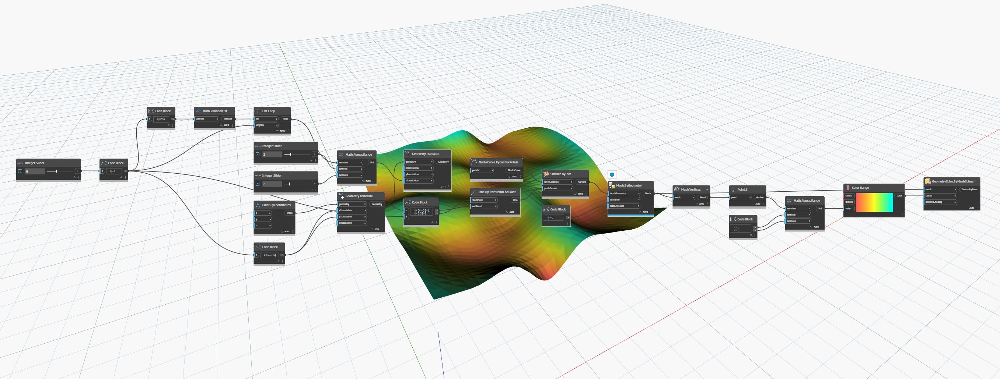

## Im Detail
`GeometryColor.ByMeshColor` gibt ein GeometryColor-Objekt zurück, bei dem es sich um ein Netz mit der Farbe entsprechend der angegebenen Farbliste handelt. Es gibt mehrere Möglichkeiten, diesen Block zu verwenden:

- Wenn eine Farbe angegeben wird, wird das gesamte Netz mit einer bestimmten Farbe gefärbt.
- Wenn die Anzahl der Farben mit der Anzahl der Dreiecke übereinstimmt, wird jedes Dreieck in der entsprechenden Farbe aus der Liste eingefärbt.
- Wenn die Anzahl der Farben mit der Anzahl der eindeutigen Scheitelpunkte übereinstimmt, interpoliert die Farbe jedes Dreiecks in der Netzfarbe zwischen den Farbwerten an jedem Scheitelpunkt.
- Wenn die Anzahl der Farben gleich der Anzahl der nicht eindeutigen Scheitelpunkte ist, interpoliert die Farbe jedes Dreiecks zwischen den Farbwerten auf einer Fläche, verschmilzt jedoch möglicherweise nicht zwischen Flächen.

## Beispiel

Im folgenden Beispiel wird ein Netz basierend auf der Höhe seiner Scheitelpunkte farbcodiert. Zuerst wird `Mesh.Vertices` verwendet, um eindeutige Netzscheitelpunkte zu erhalten, die dann analysiert werden, und die Höhe jedes Scheitelpunktpunkts wird mithilfe des Blocks `Point.Z` ermittelt. Anschließend werden mit `Map.RemapRange` die Werte einem neuen Bereich von 0 bis 1 zugeordnet, indem jeder Wert proportional skaliert wird. Schließlich wird mit `Color Range` eine Liste von Farben generiert, die den zugeordneten Werten entsprechen. Verwenden Sie diese Liste von Farben als `colors`-Eingabe des `GeometryColor.ByMeshColors`-Blocks. Das Ergebnis ist ein farbcodiertes Netz, in dem die Farbe jedes Dreiecks zwischen den Scheitelpunktfarben interpoliert, wodurch ein Farbverlauf entsteht.

## Beispieldatei

