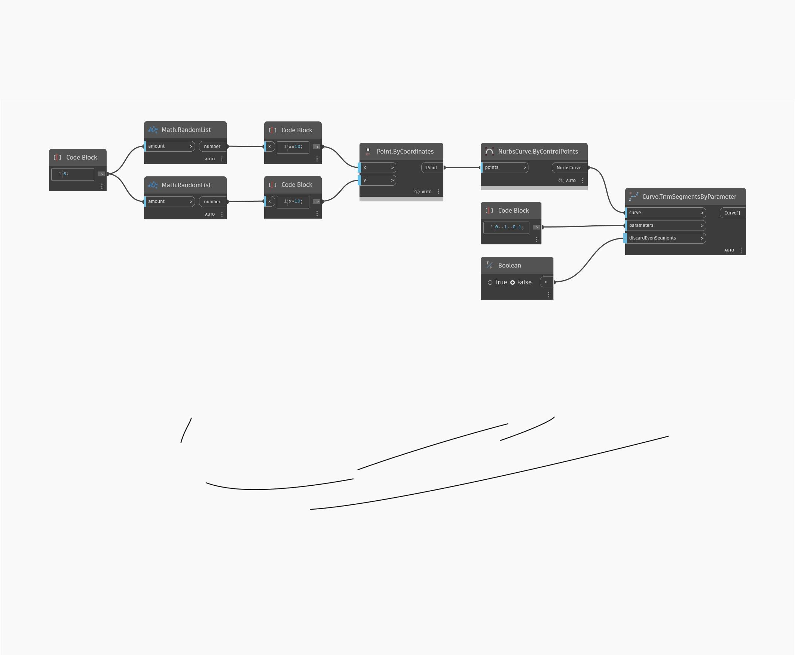

<!--- Autodesk.DesignScript.Geometry.Curve.TrimSegmentsByParameter(parameters, discardEvenSegments) --->
<!--- NAWUT5OCSCDDXI56BOEKQ7CUY4GXWEKG7CU3SYRVPVT2RF4VOOKQ --->
## Im Detail
Entfernt mehrere Segmente der Kurve, wobei die geraden verworfen werden.
___
## Beispieldatei

