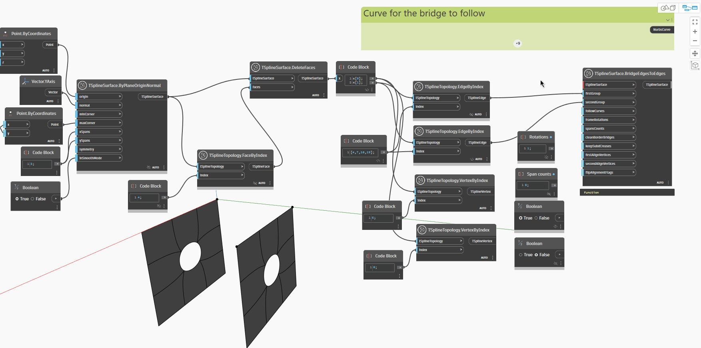

<!--- Autodesk.DesignScript.Geometry.TSpline.TSplineSurface.BridgeEdgesToEdges --->
<!--- NTIOVTTOXGWZ33W6ET5JH4PSYC7L3IFSWCJV4Y3IG3CTARQGOG3A --->
## Im Detail
`TSplineSurface.BridgeEdgesToEdges` verbindet zwei Sätze von Kanten, entweder aus derselben oder aus zwei verschiedenen Oberflächen. Der Block erfordert die unten beschriebenen Eingaben. Die ersten drei Eingaben reichen zum Generieren der Brücke aus, die übrigen Eingaben sind optional. Die resultierende Oberfläche ist ein untergeordnetes Element der Oberfläche, zu der die erste Gruppe von Kanten gehört.

- `TSplineSurface`: the surface to bridge
- `firstGroup`: Edges from the TSplineSurface selected
- `secondGroup`: Kanten entweder aus derselben ausgewählten T-Spline-Oberfläche oder aus einer anderen. Die Kanten müssen in der Anzahl übereinstimmen oder ein Vielfaches der Kantenanzahl auf der anderen Seite der Brücke sein.
- `followCurves`: (optional) a curve for the bridge to follow. In the absence of this input, the bridge follows a straight line
- `frameRotations`: (optional) number of rotations of the bridge extrusion that connects the chosen edges.
- `spansCounts`: (optional) number of spans/segments of the bridge extrusion that connects the chosen edges. If the number of spans is too low, certain options might not be available until it is increased.
- `cleanBorderBridges`:(optional) deletes bridges between border bridges to prevent creases
- `keepSubdCreases`:(optional) preserves the SubD-creases of the input topology, resulting in a creased treatement of the start and end of the bridge
- `firstAlignVertices`(optional) and `secondAlignVertices`: enforce the alignment between two sets of vertices instead of automatically choosing to connect pairs of closest vertices.
- `flipAlignFlags`: (optional) reverses the direction of vertices to align

Im folgenden Beispiel werden zwei T-Spline-Ebenen erstellt, und eine Fläche in der Mitte jeder Ebene wird mithilfe des Blocks `TSplineSurface.DeleteEdges` gelöscht. Die Kanten um die gelöschte Fläche werden mithilfe des Blocks `TSplineTopology.VertexByIndex` erfasst. Zum Erstellen einer Brücke werden zwei Gruppen von Kanten zusammen mit einer der Oberflächen als Eingabe für den Block `TSplineSurface.BrideEdgesToEdges` verwendet. Dadurch wird die Brücke erstellt. Durch Bearbeiten der Eingabe `spansCounts` werden weitere Felder zur Brücke hinzugefügt. Wenn eine Kurve als Eingabe für `followCurves` verwendet wird, folgt die Brücke der Richtung der angegebenen Kurve. Die Eingaben `keepSubdCreases`,`frameRotations`, `firstAlignVertices` und `secondAlignVertices` zeigen, wie die Form der Brücke verfeinert werden kann.

## Beispieldatei

