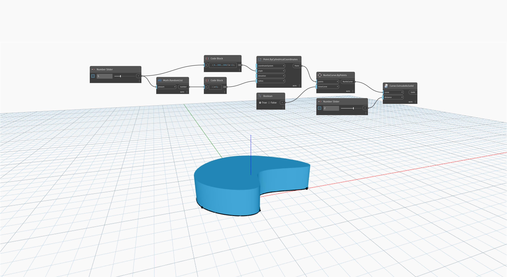

<!--- Autodesk.DesignScript.Geometry.Curve.ExtrudeAsSolid(curve, distance) --->
<!--- NWZ4OHZGJ3DY35YJAGFATFVE4TKRWATQD3KYVPZ6JOGMLBYXOLLA --->
## Im Detail
`Curve.ExtrudeAsSolid (curve, distance)` extrudiert eine eingegebene geschlossene, planare Kurve mithilfe einer eingegebenen Zahl, um den Abstand der Extrusion zu bestimmen. Die Richtung der Extrusion wird durch den Normalenvektor der Ebene bestimmt, in der sich die Kurve befindet. Dieser Block verschließt die Enden der Extrusion, um einen Volumenkörper zu erstellen.

Im folgenden Beispiel wird zunächst mithilfe eines `NurbsCurve.ByPoints`-Blocks ein NurbsCurve-Objekt mit einem Satz zufällig generierter Punkte als Eingabe erstellt. Anschließend wird die Kurve mit einem `Curve.ExtrudeAsSolid`-Block als Volumenkörper extrudiert. Ein Zahlen-Schieberegler wird als `distance`-Eingabe im Block `Curve.ExtrudeAsSolid` verwendet.
___
## Beispieldatei

