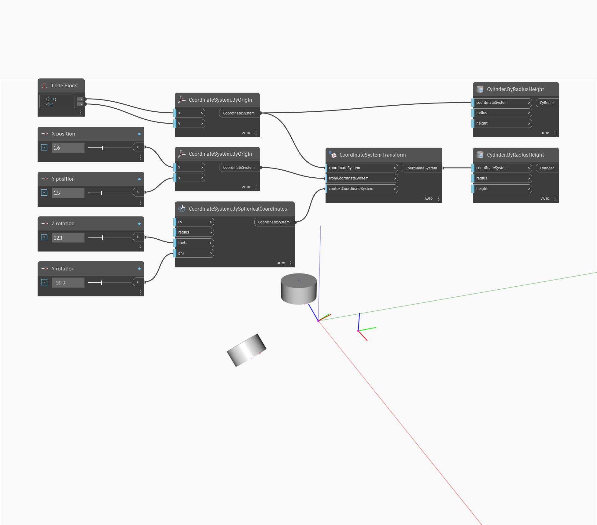

<!--- Autodesk.DesignScript.Geometry.Geometry.Transform(geometry, fromCoordinateSystem, contextCoordinateSystem) --->
<!--- OC4QHO6N4KYVUT4GX3X6NKCYO22OJ6JU6DCATPIKSF4G7DF6CZJA --->
## Im Detail
Transformiert diese Geometrie aus dem Quell-CoordinateSystem in das CoordinateSystem eines neuen Kontexts.
___
## Beispieldatei

