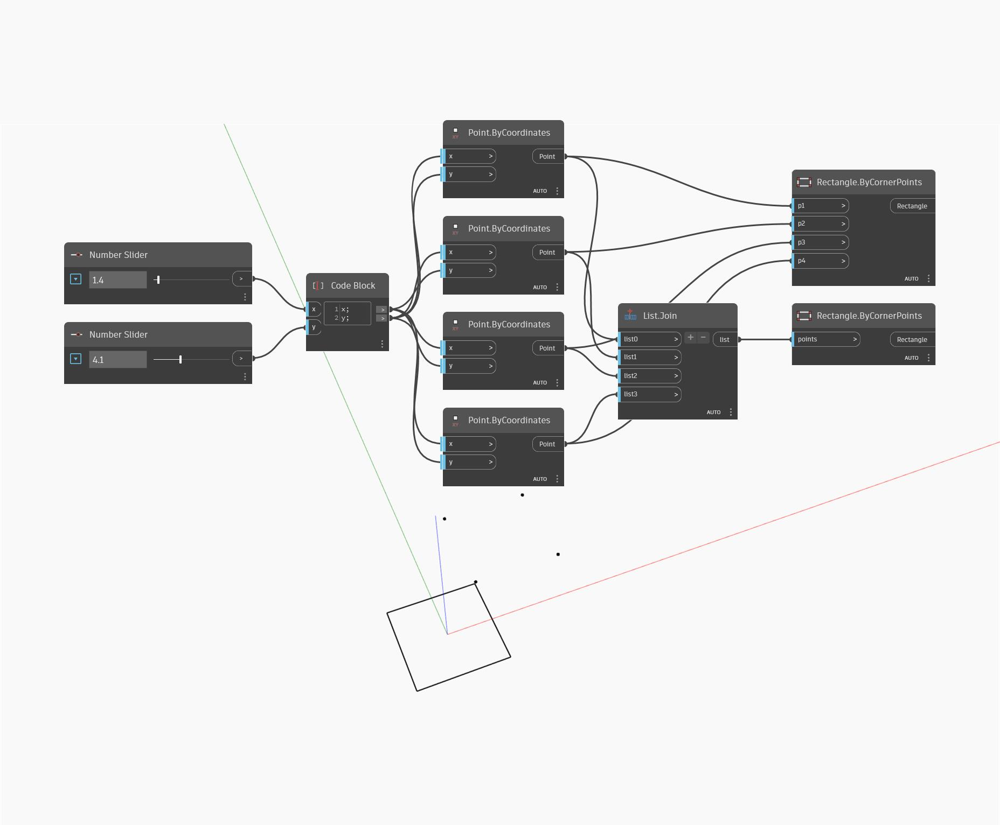

<!--- Autodesk.DesignScript.Geometry.Rectangle.ByCornerPoints(p1, p2, p3, p4) --->
<!--- OPQ3MDKAFIBB5WD3XJ65RI5GHYZKCQG4WU3XBCFBOP526FMMNPZQ --->
## Im Detail
Der Block Rectangle By Corner Points erstellt aus vier Eingabepunkten ein Rechteck. Die Eingabepunkte müssen rechteckig sein. In diesem Beispiel werden zwei Zahlen-Schieberegler verwendet, um ein Points By Coordinates-Objekt an den Scheitelpunkten des Rechtecks zu erstellen. Ein ähnlicher, aber eindeutiger Rectangle ByCornerPoints-Block verwendet eine Liste mit Punkten als Eingabe anstelle der einzelnen Eingaben. In diesem Beispiel werden beide Blöcke gezeigt.
___
## Beispieldatei

