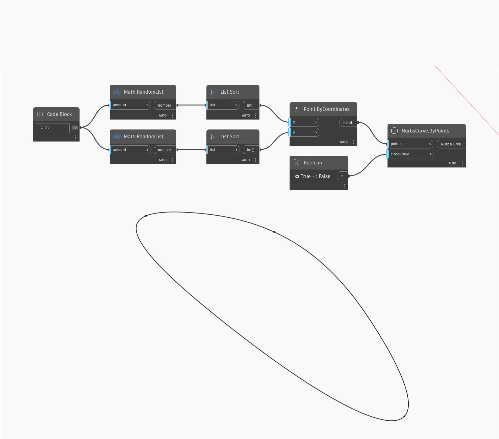

<!--- Autodesk.DesignScript.Geometry.NurbsCurve.ByPoints(points, closeCurve) --->
<!--- R56RKDC3YJDKDO3WMJD2V4SIMHIJCNVQ6PZV7SMATQASDKE7WEMA --->
## Im Detail
Mit Nurbs Curve By Points wird eine Liste mit Punkten eingegeben, durch die eine NURBS-Kurve gezeichnet werden soll. Außerdem können Sie die Kurve schließen. In diesem Beispiel werden vier zufällige Punkte auf der Welt-XY-Ebene generiert und in der Reihenfolge der X- und Y-Richtungen miteinander verbunden, wodurch die Kurve wieder zum ersten Punkt in der Liste geschlossen wird.
___
## Beispieldatei

