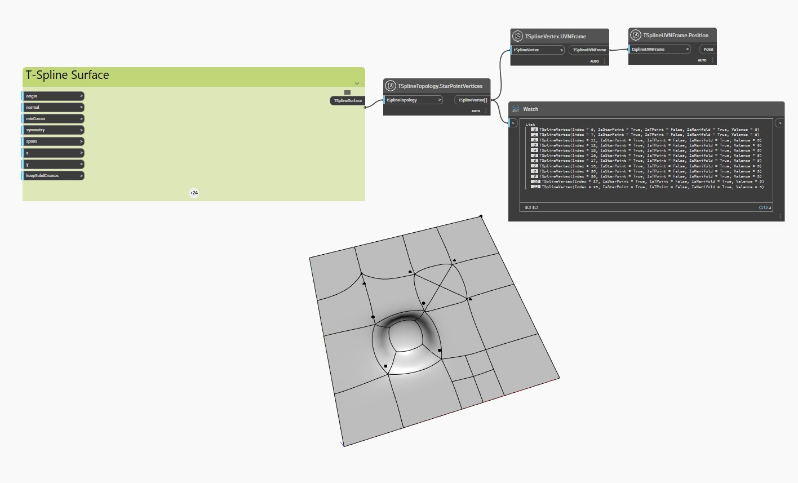

<!--- Autodesk.DesignScript.Geometry.TSpline.TSplineTopology.StarPointVertices --->
<!--- RMKGTFPZFLM5GGB475DWTHXFTJCBZQXE2HEVNUZA6OS72LH53HVQ --->
## Im Detail
Im folgenden Beispiel wird eine planare T-Spline-Oberfläche mit extrudierten, unterteilten und gezogenen Scheitelpunkten und Flächen mit dem Block `TSplineTopology.StarPointVertices` dahingehend überprüft, ob es sich bei einem der Scheitelpunkte um Sternpunkte handelt.

Die Blöcke `TSplineVertex.UVNFrame` und `TSplineUVNFrame.Position` werden verwendet, um die Sternpunkte der Oberfläche hervorzuheben.
___
## Beispieldatei

