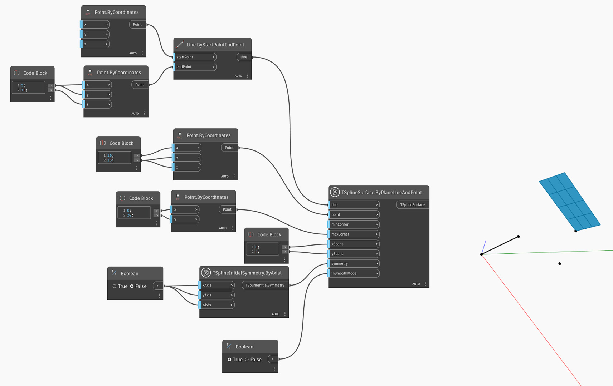

<!--- Autodesk.DesignScript.Geometry.TSpline.TSplineSurface.ByPlaneLineAndPoint --->
<!--- SFB4J46343LP6YKDRW2FPILSS6UXITLDXWQKYJRD6LWHQJY2IYOA --->
## In-Depth
Mit `TSplineSurface.ByPlaneLineAndPoint` wird eine T-Spline-Grundkörper-Ebenenoberfläche aus einer Linie und einem Punkt erstellt. Die resultierende T-Spline-Oberfläche ist eine Ebene. Zum Erstellen der T-Spline-Ebene verwendet der Block die folgenden Eingaben:
- `line` und `point`: Eingabe, die zur Definition der Ausrichtung und Position der Ebene erforderlich ist.
- `minCorner` and `maxCorner`: the corners of the plane, represented as Points with X and Y values (Z coordinates will be ignored). These corners represent the extents of the output T-Spline surface if it is translated onto the XY plane. The `minCorner` and `maxCorner` points do not have to coincide with the corner vertices in 3D. For example, when a `minCorner` is set to (0,0) and `maxCorner` is (5,10), the plane width and length will be 5 and 10 respectively.
- `xSpans` and `ySpans`: number of width and length spans/divisions of the plane
- `symmetry`: whether the geometry is symmetrical with respect to its X, Y and Z axes
- `inSmoothMode`: whether the resulting geometry will appear with smooth or box mode

Im folgenden Beispiel wird eine planare T-Spline-Oberfläche mit einer Linie und einer Ebene als Eingabe erstellt. Die Größe der Oberfläche wird durch die beiden als `minCorner`- und `maxCorner`-Eingaben verwendeten Punkte gesteuert.

## Beispieldatei

