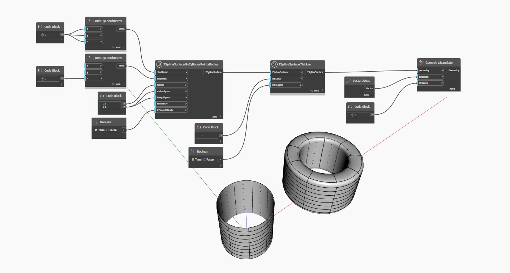

## Im Detail
`TSplineSurface.Thicken(distance, softEdges)` verdickt eine T-Spline-Oberfläche um einen bestimmten `distance`-Wert entlang der Flächennormalen nach außen (oder nach innen, wenn ein negativer Wert für `distance` angegeben wird). Die boolesche Eingabe `softEdges` steuert, ob die resultierenden Kanten geglättet (True) oder geknickt (False) werden.

Im folgenden Beispiel wird eine zylindrische T-Spline-Oberfläche mit dem Block `TSplineSurface.Thicken(distance, softEdges)` verdickt. Die resultierende Oberfläche wird zur besseren Visualisierung zur Seite verschoben.
___
## Beispieldatei

