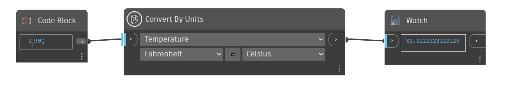

## Im Detail
`Convert By Units` konvertiert den Eingabewert einer bestimmten Einheit in eine entsprechende Einheit in einem anderen Einheitensystem. Die verfügbaren Optionen hängen davon ab, welcher Einheitentyp in der ersten Dropdown-Liste ausgewählt wird. Verwenden Sie die Pfeilschaltfläche, um die Einheiten von links nach rechts zu wechseln.

In diesem Beispiel verwenden wir `Convert By Units`, um zwischen Fahrenheit und Celsius umzurechnen. Zuerst wird in der ersten Dropdown-Liste Temperatur ausgewählt, wodurch in den beiden unteren Dropdown-Listen nur temperaturabhängige Optionen angezeigt werden.
___
## Beispieldatei

