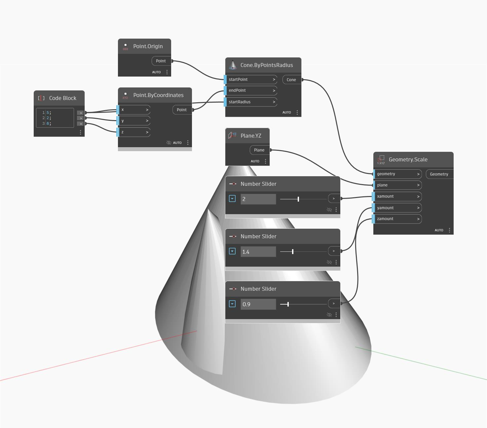

<!--- Autodesk.DesignScript.Geometry.Geometry.Scale(plane, xamount, yamount, zamount) --->
<!--- VH3KQEMEQFHQ4Z45T42EMLXFENVMZSCLRKQMQVBQNLE4YVTF5HTA --->
## Im Detail
Skaliert ungleichmäßig von der angegebenen Ebene aus.
___
## Beispieldatei

