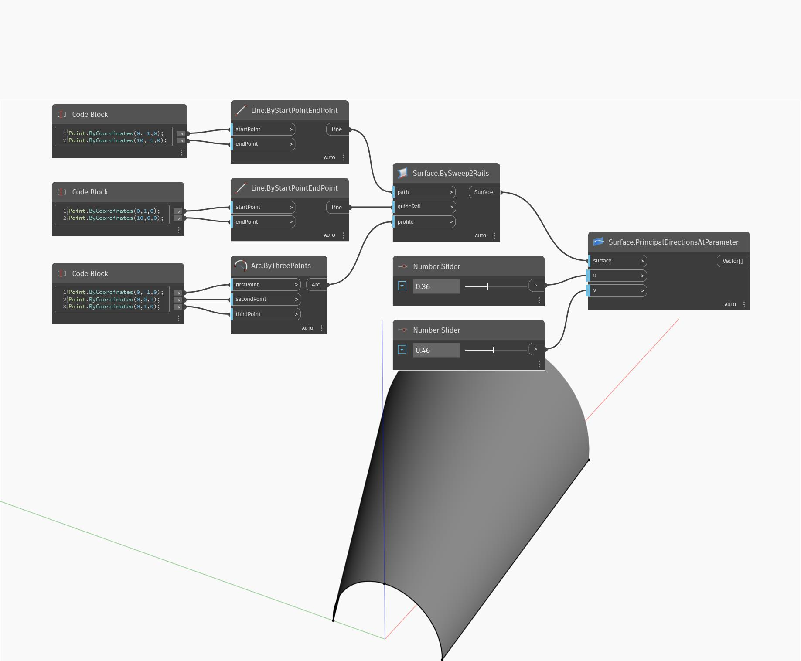

<!--- Autodesk.DesignScript.Geometry.Surface.PrincipalDirectionsAtParameter --->
<!--- VQHTU47YI7VCJWMQZ6UQGNNGBZZD7KX3UZHFGPYMVRITKMY3HB6Q --->
## Im Detail
Principal Directions at Parameter verwendet U- und V-Eingabeparameter und gibt die Krümmungen in U- und V-Richtung zurück. Dieser Block gibt eine Liste mit zwei Vektoren zurück, wobei der erste der Richtungsvektor in U-Richtung und der zweite der Richtungsvektor in V-Richtung ist. Im folgenden Beispiel erstellen Sie zunächst eine Oberfläche mit BySweep2Rails. Anschließend ermitteln Sie mit zwei Zahlen-Schiebereglern die U- und V-Parameter, um die Richtung mithilfe eines PrincipalDirectionsAtParameter-Blocks zu ermitteln.
___
## Beispieldatei

