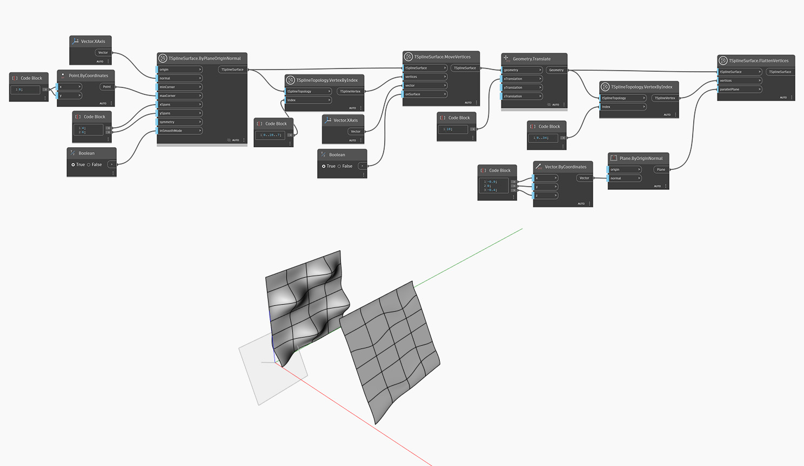

## Im Detail
`TSplineSurface.FlattenVertices(vertices, parallelPlane)` ändert die Positionen der Steuerpunkte für einen bestimmten Satz von Scheitelpunkten, indem sie an einer `parallelPlane`-Eingabe ausgerichtet werden.

Im folgenden Beispiel werden die Scheitelpunkte einer T-Spline-Ebenenoberfläche mithilfe der Blöcke `TsplineTopology.VertexByIndex` und `TSplineSurface.MoveVertices` verschoben. Die Oberfläche wird dann zum Zwecke einer besseren Vorschau zur Seite verschoben und als Eingabe für einen `TSplineSurface.FlattenVertices(vertices, parallelPlane)`-Block verwendet. Das Ergebnis ist eine neue Oberfläche, bei der ausgewählte Scheitelpunkte flach auf der angegebenen Ebene liegen.
___
## Beispieldatei

