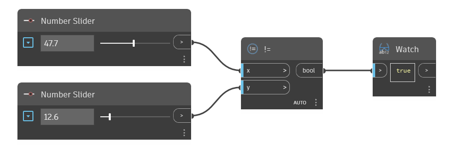

## In Depth
The `!=` node is the Not Equal To operator. It takes two input values and returns True if the two values are not equal and False if the two values are equal. 

In the example below, a `!=` node is used to determine if the two input values are not equal. We use two number sliders to control the inputs to the `!=` operator.
___
## Example File

