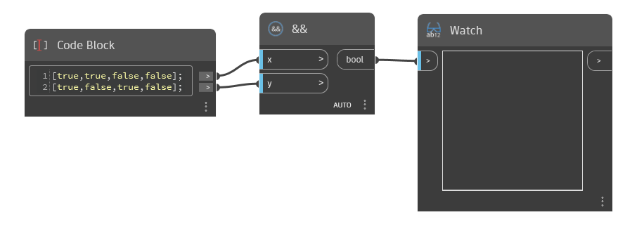

## In Depth
`&&` accepts two Boolean values, or lists of Boolean values, and determines whether both values are True. In all other cases, it returns False.

In the example below, we start with two lists of Boolean values. Together, these lists represent the 4 possible combinations of True and False values. `&&` returns True only for the first pair of values, which are both True. The others are either combinations of True and False, or False and False, so `&&` returns False.
___
## Example File

