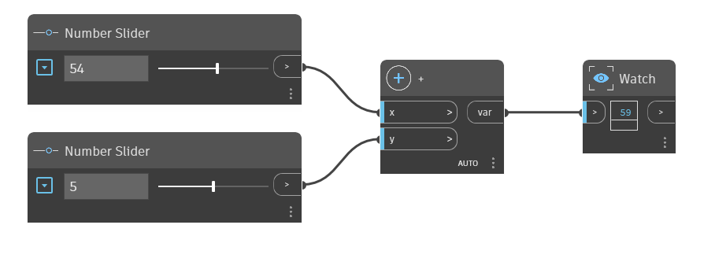

## In Depth
The node ‘+’ is the addition operator. It returns the sum of the two input numbers. In the example below, two number sliders are used to control the inputs to the ‘+’ operator.
___
## Example File

