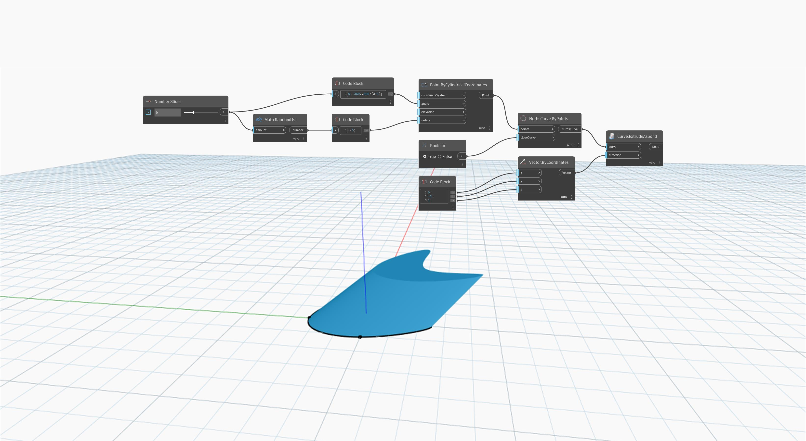

<!--- Autodesk.DesignScript.Geometry.Curve.ExtrudeAsSolid(curve, direction) --->
<!--- 32PIZL43K2RTMXYNALUOXTTTTLRY2XQHUK22D2A7KI7NAA5JTXBA --->
## In Depth
`Curve.ExtrudeAsSolid (curve, direction)` extrudes an input closed, planar curve using an input vector to determine the direction of the extrusion. The length of the vector is used for the extrusion distance. This node caps the ends of the extrusion to create a solid. 

In the example below, we first create a NurbsCurve by using a `NurbsCurve.ByPoints` node, with a set of randomly generated points as the input. A code block is used to specify the X, Y, and Z components of a `Vector.ByCoordinates` node. This vector is then used as the direction input in an `Curve.ExtrudeAsSolid` node.
___
## Example File

