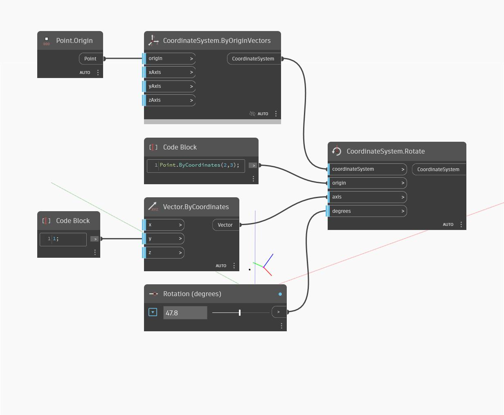

<!--- Autodesk.DesignScript.Geometry.CoordinateSystem.Rotate(origin, axis, degrees) --->
<!--- 3JO6UW566EG3MSCU25AGJTTDKZSMAZZO7D4VC5APLFDZVUEMPDSA --->
## In Depth
Rotates a coordinate system around an origin and an axis by a specified degree.
___
## Example File

