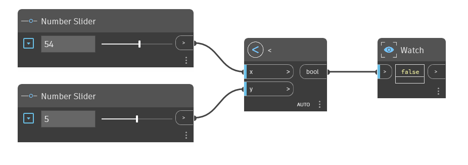

## In Depth
The `<` node is the Less Than operator. If the `x` input is less than the `y` input, it returns True. If `x` is greater than `y`, or if the two values are equal, this operator returns False. Exists in 1.x dictionary; edited Graph name: LessThan.dyn Y

In the example below, a `<` node is used to determine if the `x` input is less than the `y` input. We use two number sliders to control the inputs to the `<` operator.
___
## Example File

