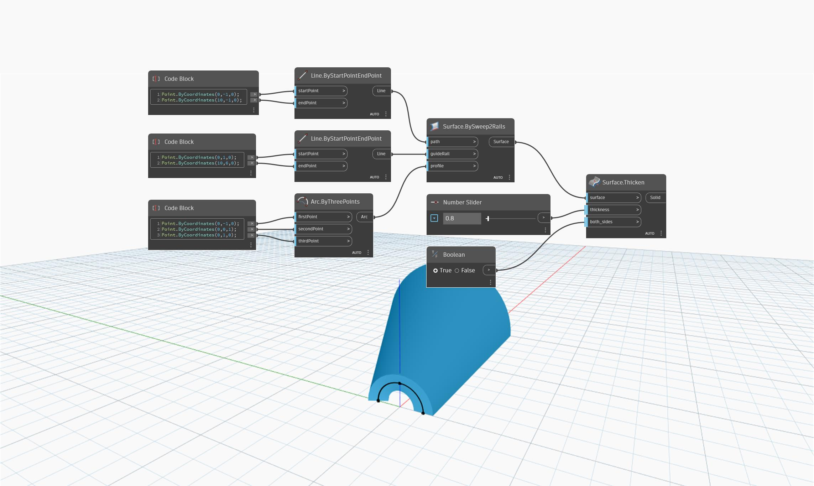

<!--- Autodesk.DesignScript.Geometry.Surface.Thicken(surface, thickness, both_sides) --->
<!--- 5HLUQKT3UZOAWPJMHUXPRYXIG5HOMTLY5RMTZVDGAABIO5MZ3OVQ --->
## In Depth
`Surface.Thicken (surface, thickness, both_sides)` creates a solid by offsetting a surface according to the `thickness` input and by capping the ends to close the solid. This node has an extra input to specify whether or not to thicken on both sides. The `both_sides` input takes a Boolean value: True to thicken on both sides, and False to thicken on one side. Note that the `thickness` parameter determines the total thickness of the final solid, so if `both_sides` is set to True, the result will be offset from the original surface by half the input thickness on both sides.

In the example below, we first create a surface by using a `Surface.BySweep2Rails`. We then create a solid by using a number slider to determine the `thickness` input of a `Surface.Thicken` node. A Boolean toggle controls whether to thicken on both sides or just one. 

___
## Example File

