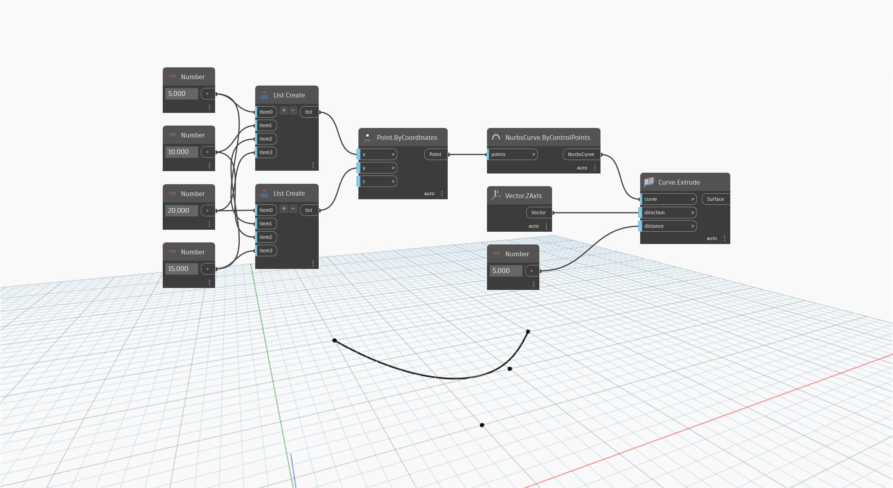

<!--- Autodesk.DesignScript.Geometry.Curve.Extrude(curve, direction, distance) --->
<!--- 5NB3FDYBJDTGURCB4X7W2I7P2TIGXAXPEUVWUMM2BTWHJ3GXRJQA --->
## In Depth
`Curve.Extrude (curve, direction, distance)` extrudes an input curve using an input vector to determine the direction of the extrusion. A separate `distance` input is used for the extrusion distance. 

In the example below, we first create a NurbsCurve using a `NurbsCurve.ByControlPoints` node, with a set of randomly generated points as the input. A code block is used to specify the X, Y, and Z components of a `Vector.ByCoordinates` node. This vector is then used as the direction input in an `Curve.Extrude` node while a `number slider` is used to control the `distance` input.
___
## Example File

