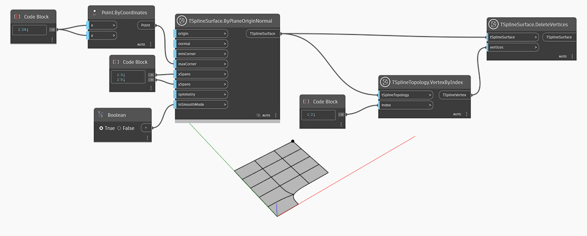

<!--- Autodesk.DesignScript.Geometry.TSpline.TSplineSurface.DeleteVertices --->
<!--- 76IVI422OMRMPHCWZHTETSZ3PJF22AOV2AX274LZCNLPCK664PGQ --->
## In Depth
In the example below, a plane primitive T-Spline surface is created using a `TSplineSurface.ByPlaneOriginNormal` node. A set of vertices is selected with `TSplineTopology.VertexByIndex` node and supplied as input into the `TSplineSurface.DeleteVertices` node. As a result, all edges joining at the selected vertex are also deleted.

## Example File

