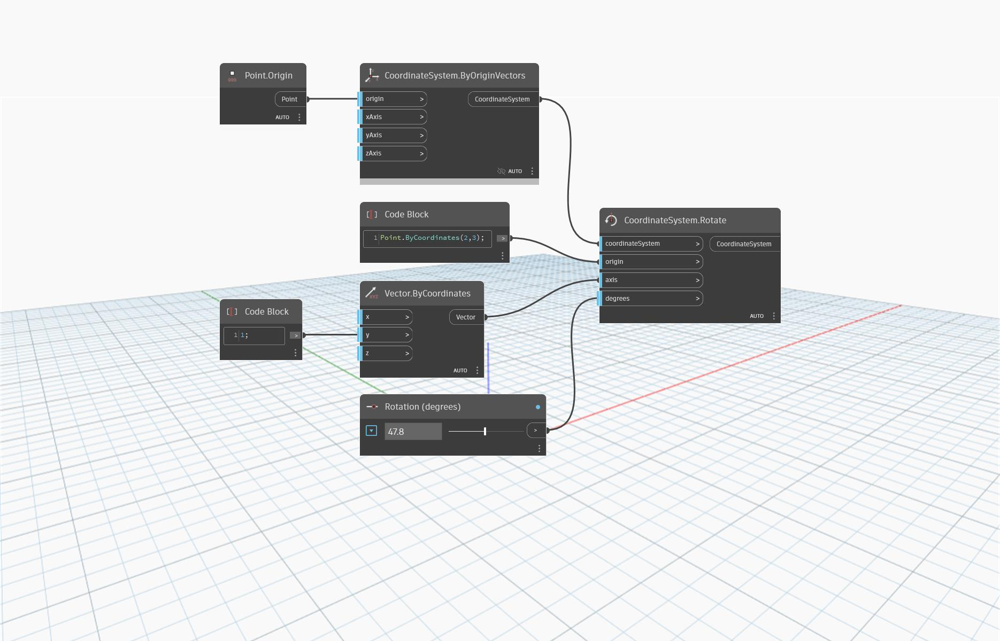

<!--- Autodesk.DesignScript.Geometry.CoordinateSystem.Rotate(coordinateSystem, origin, axis, degrees) --->
<!--- AUJIYC7MERJPYMO5VHIFF7FPJD5YMEBOHOMWKROVKZCF66ZIBZ2A --->
## In Depth
`CoordinateSystem.Rotate (coordinateSystem, origin, axis, degrees)` returns a new CoordinateSystem rotated about an origin and vector. 

In the example below, a CoordinateSystem is rotated about an origin point at (2,0,0) and a vector equivalent to the Y axis. More complex rotations can be achieved with more complex vectors.

___
## Example File

