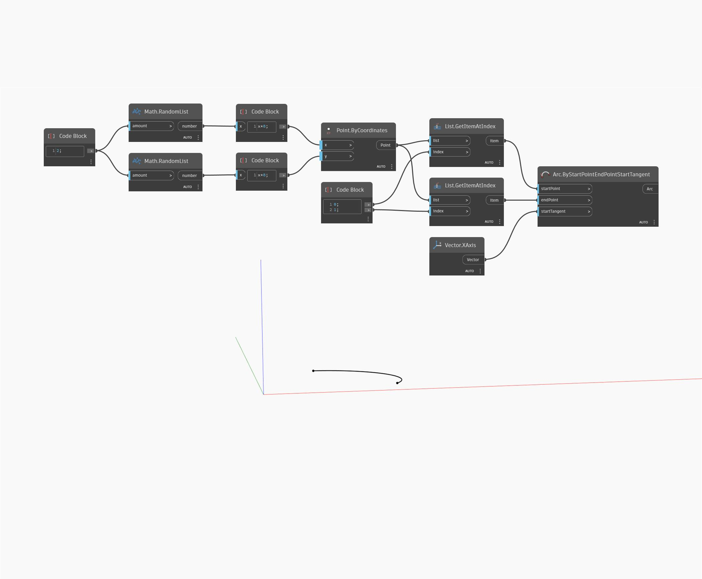

## In Depth
Arc ByStartPointEndPointStartTangent draws an arc from two specified points and any given start vector. This example draws an arc from two random points that is always tangent to the X-Axis.
___
## Example File

