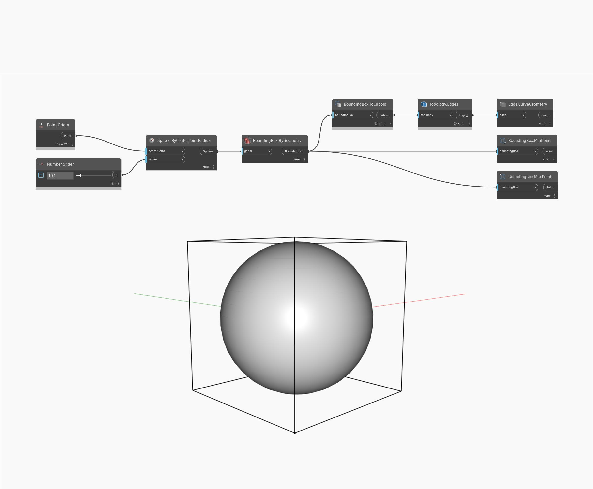

## In Depth
`BoundingBox.ByGeometry` creates a BoundingBox around geometry.

In the example below, a BoundingBox is created around a sphere. To visualize the box, it is converted to a cuboid and its edge curves are extracted.

___
## Example File

