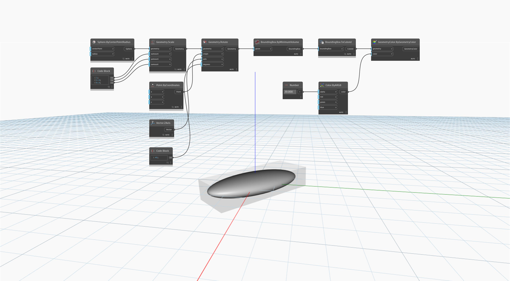

## In Depth
`BoundingBox.ByMinimumVolume` creates the smallest possible bounding box around the input geometry, “shrinkwrapping” it tightly.

In the example below, a minimum-volume bounding box is created around a sphere.
___
## Example File

