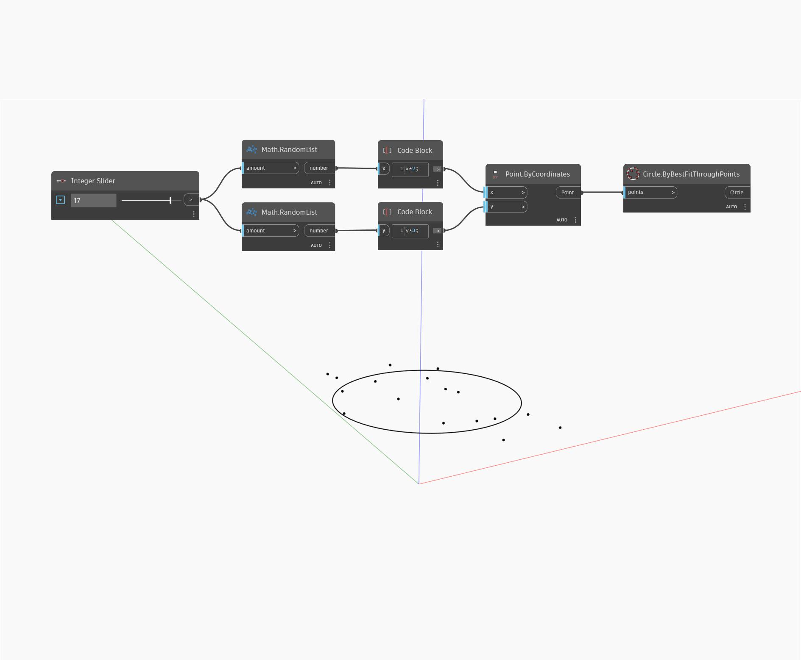

## In Depth
`Circle.ByBestFitThroughPoints` receives point inputs and creates a best-fit circle through them. 

In the example below, a list of randomly generated points is used to generate a circle that best approximates them. We can dynamically increase and decrease the number of points with a number slider, altering the shape of the best-fit circle.

___
## Example File

