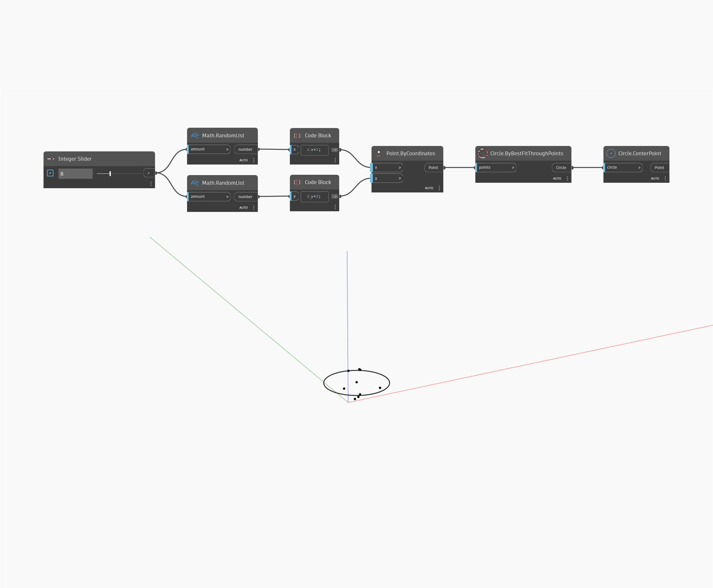

## In Depth
`Circle.CenterPoint` finds the center point of a given circle. 

In the example below, we create a circle using `Circle.BestFitThroughPoints` and then extract the center point of the circle.

___
## Example File

