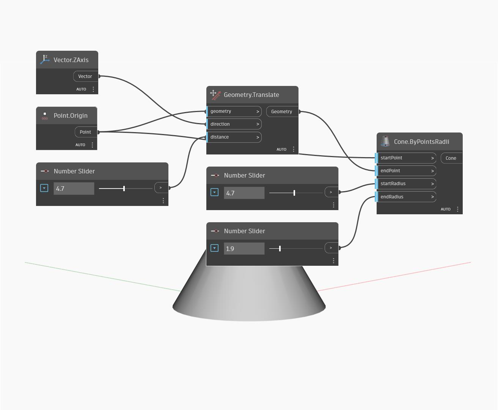

## In Depth
Cone ByPointsRadii creates a truncated Cone geometry from a Start Point, End Point, and two Radius values. This example shows a dynamic Cone around the World Origin, constructed with three Number Sliders controlling its Height and Radius sizes.
___
## Example File

