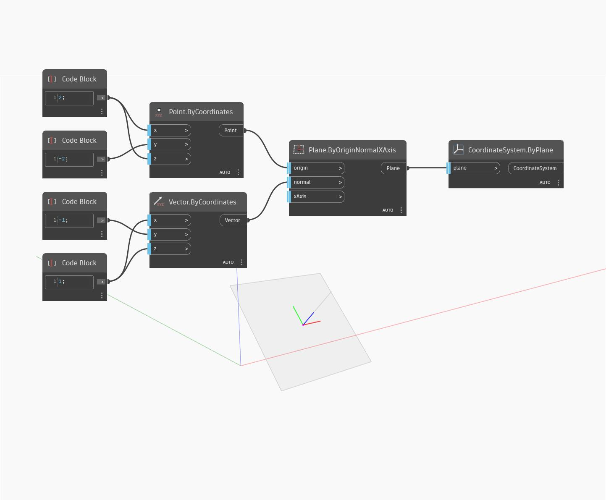

## In Depth
`CoordinateSystem.ByPlane` returns a new CoordinateSystem based on an input plane. 

In the example below, the normal of the input plane has been repositioned, resulting in a new CoordinateSystem rotated about the X axis.

___
## Example File

