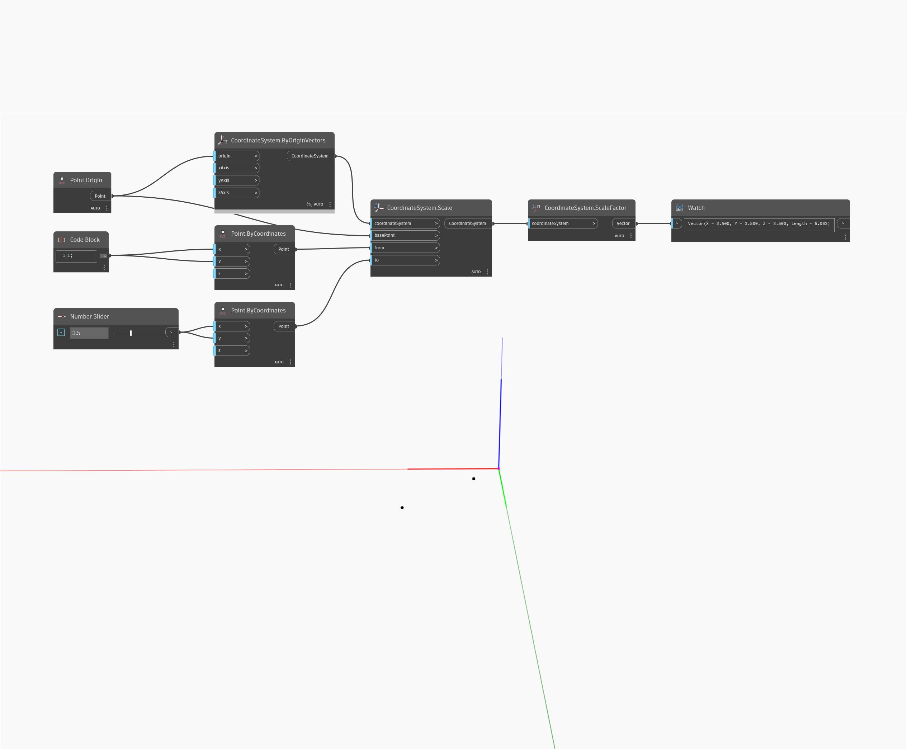

## In Depth
ScaleFactor will return a Vector consisting of the X, Y, and Z scale factors of a CoordinateSystem. In the example below, a scaled CoordinateSystem returns a Vector with X, Y, and Z values of 4.4 and a length of 7.621.
___
## Example File

