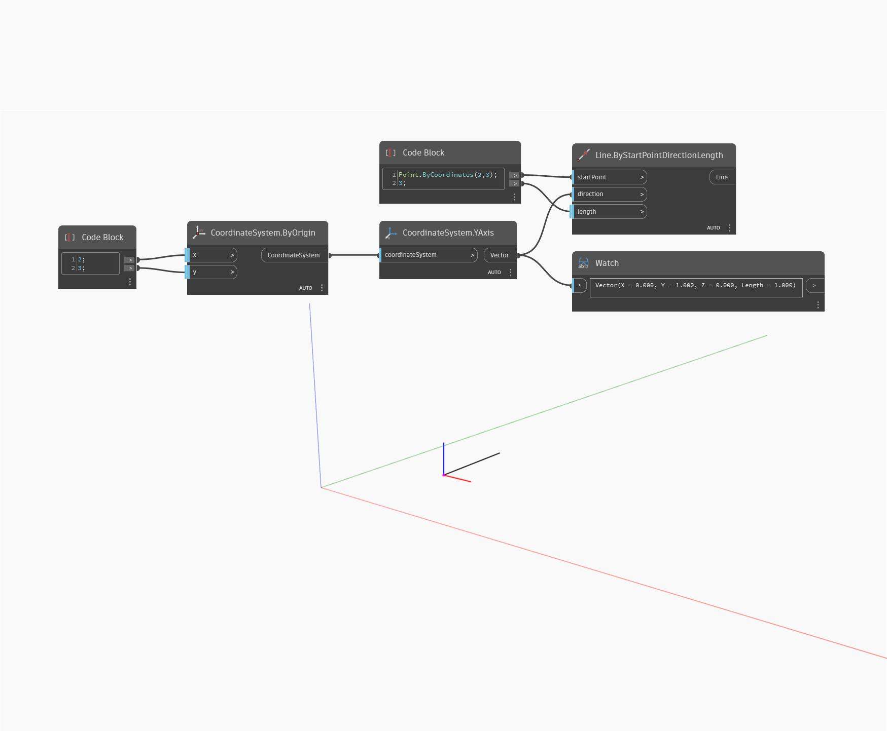

## In Depth
YAxis will return a Vector that represents the WorldCoordinateSystem Y axis. In the example below, the Vector returned is used to create a Line that follows the WCS Y axis.
___
## Example File

