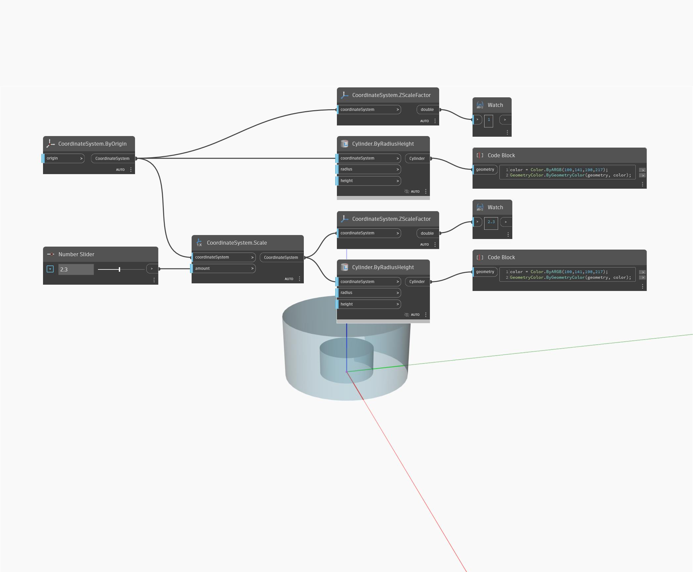

## In Depth
ZScaleFactor will return a double representing the scale factor along the Z Axis. In the example below, a cylinder is scaled by 2.3, returning an Z scale factor of 2.3.
___
## Example File

