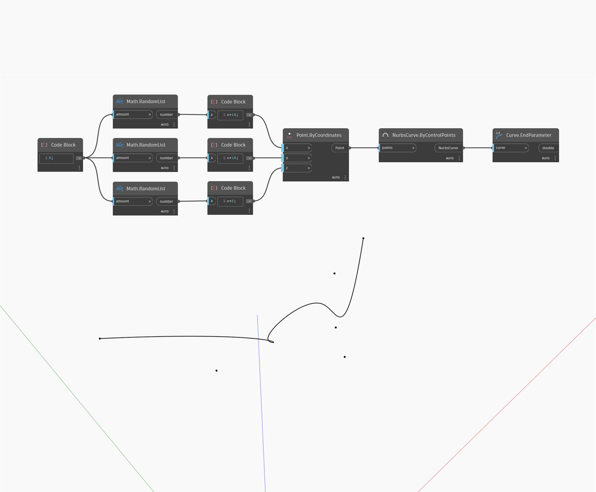

## In Depth
End Parameter will return a number that represents the end of the domain in which the input curve can be evaluated. In most cases the end parameter will be one. In the example below, we first create a Nurbs Curve using a ByControlPoints node, with a set of randomly generated points as the input. This curve is then used as the input to an EndParameter node. 
___
## Example File

