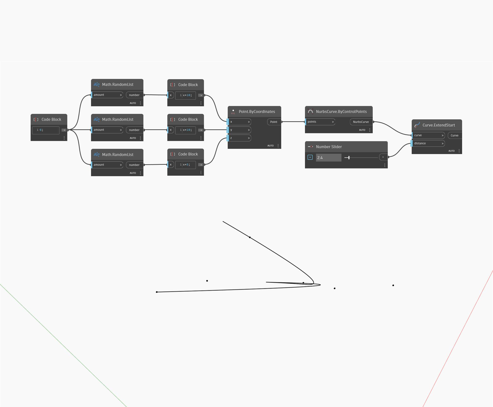

## In Depth
Extend Start will extend a input curve by a given input distance, starting from the start point of the curve. In the example below, we first create a Nurbs Curve using a ByControlPoints node, with a set of randomly generated points as the input. A number slider allows us to control the distance of the extension.
___
## Example File

