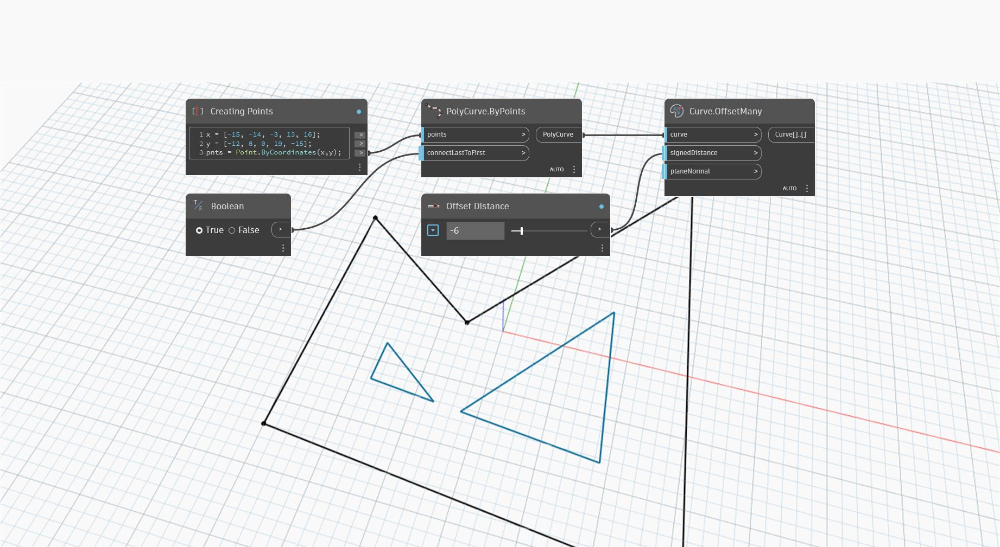

## In Depth
`Curve.OffsetMany` creates one or more curves by offsetting a planar curve by the given distance in a plane defined by the plane normal. If there are gaps between the offset component curves, they are filled by extending the offset curves. 

The `planeNormal` input defaults to the normal of the plane containing the curve, but an explicit normal parallel to the original curve normal can be provided to better control the direction of the offset. 

For example, if a consistent offset direction is required for multiple curves sharing the same plane, the `planeNormal` input can be used to override individual curve normals and force all curves to be offset in the same direction. Reversing the normal reverses the direction of the offset.

In the example below, a polycurve is offset by a negative offset distance, which applies in the opposite direction of the cross product between the curve’s tangent and the plane’s normal vector.
___
## Example File

