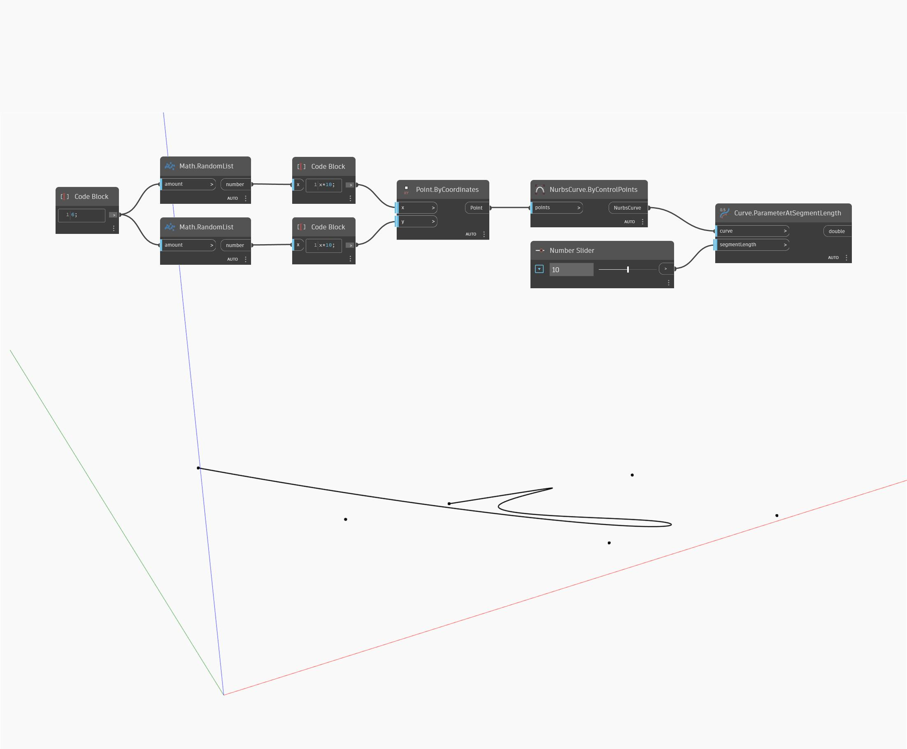

## In Depth
Parameter At Segment Length will return the parameter of a point that is a given length along the curve from the start point. In the example below, we first create a Nurbs Curve using a ByControlPoints node, with a set of randomly generated points as the input. A number slider is used to control the segment length to find a parameter at. If the input segment length is longer than the curve, this node will return the parameter value of the end point of the curve.
___
## Example File

