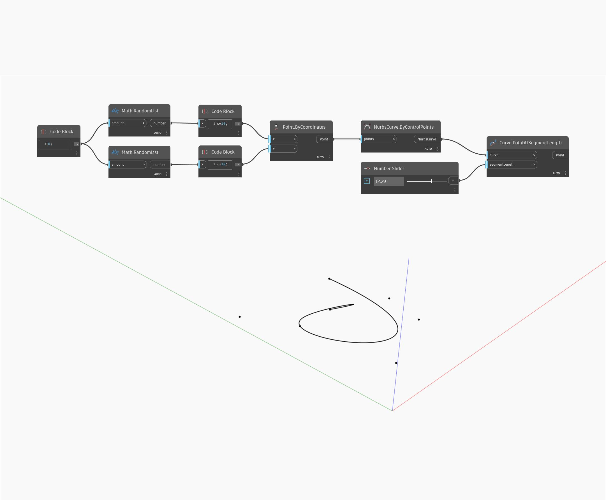

## In Depth
Point At Segment Length will return the point on a curve at a given length along the curve, measured from the start point of the curve. If the input length is greater than the length of the curve, the node will return the end point of the curve. In the example below, we use two sets of random numbers to generate a list of points. These points are used to create a Nurbs Curve by Control Points. A number slider is and used as the input length to a Point At Segment Length node. 
___
## Example File

