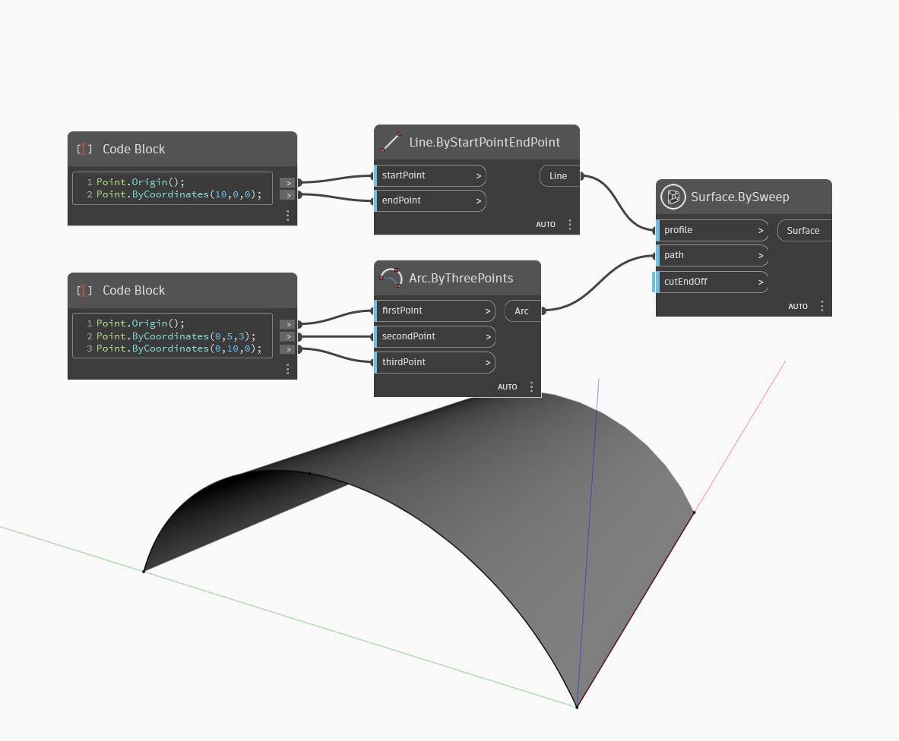

## In Depth
SweepAsSurface will create a surface by sweeping an input curve along a specfied path. In the example below, we create a curve to sweep by useing a Code Block to create three points of an Arc.ByThreePoints node. A path curve is created a simple line along the x-axis. SweepAsSurface moves the profile curve along the path curve creating a surface.
___
## Example File

